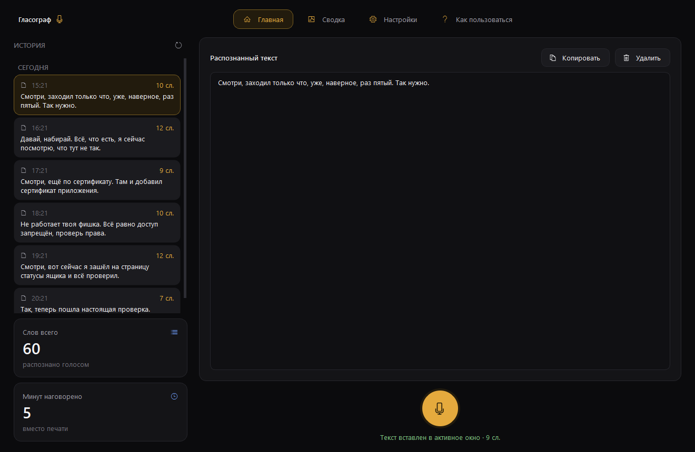
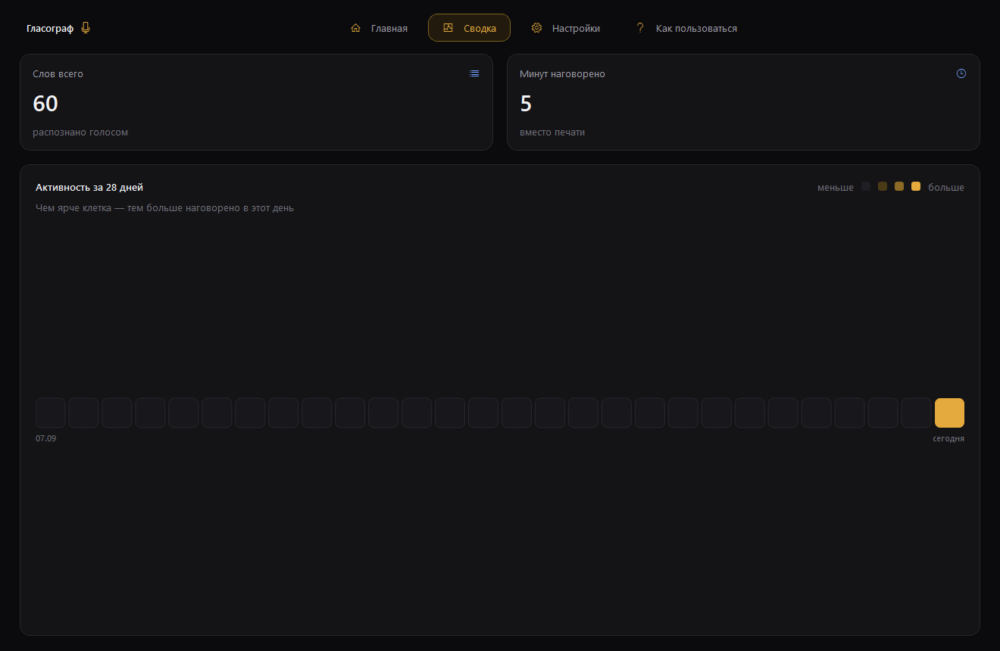
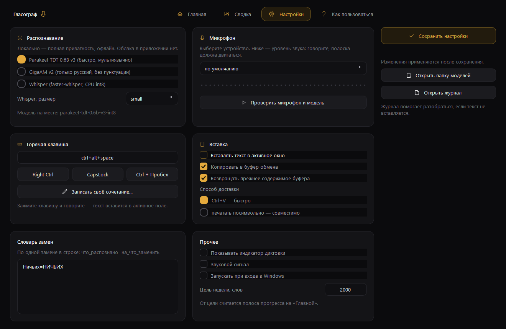
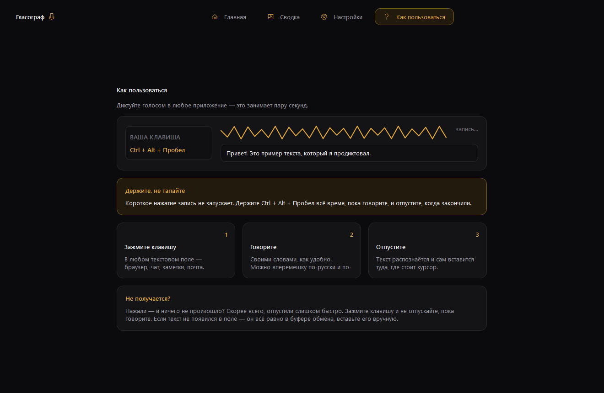
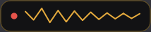
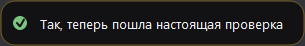

# Гласограф

Локальная голосовая диктовка для Windows. Без аккаунта, подписки и облака:
звук уходит только в локальную модель на вашем компьютере.

Сделано по мотивам [PantelaVoice](https://github.com/EvgenyPantela/PantelaVoice)
(SwiftUI, macOS) и под конкретную машину — **Intel Core i5-4460, 4 ядра, 8 ГБ RAM,
без пригодного GPU** — поэтому движок по умолчанию не Whisper large-v3-turbo, а
**Parakeet TDT 0.6B v3 (int8)**: он и быстрее, и точнее на этом процессоре.
Замеры — в [bench/REPORT.md](bench/REPORT.md).

Интерфейс — на **Qt (PySide6)**: главное окно с четырьмя разделами, индикатор
диктовки поверх всех окон и значок в трее.

## Как пользоваться

1. Запустить **`Glasograf.bat`** (двойной клик). Откроется окно и появится
   значок микрофона в трее.
2. Поставить курсор в любое текстовое поле.
3. Зажать **Ctrl + Alt + Пробел**, сказать фразу, отпустить клавиши.
4. Через ~1 секунду текст сам вставится в поле (Ctrl+V), а также останется в
   буфере обмена и в истории приложения.

Пока идёт запись, внизу экрана виден компактный индикатор: красный кружок и
волна уровня микрофона. Слов в нём нет — говорит анимация; когда текст готов,
индикатор превращается в короткое сообщение с распознанной фразой.
**Esc** во время диктовки отменяет её. Комбинация Ctrl+Alt+Пробел не попадает в
приложения, так что в текст не вставится лишний пробел.

Окно можно закрыть крестиком — приложение продолжит работать в трее, диктовка
не прервётся. Вернуть окно: двойной клик по значку в трее или пункт
«Открыть окно».

## Окно приложения

**Главная** — история диктовок (сгруппирована по дням, у каждой записи время и
число слов), справа последний распознанный текст с кнопками «Копировать» и
«Удалить», под ним большая кнопка микрофона для диктовки без горячей клавиши.
Внизу слева — сколько всего слов и минут наговорено.



**Сводка** — те же два счётчика и лента активности за 28 дней: чем ярче клетка,
тем больше наговорено в этот день.



**Настройки** — движок распознавания, микрофон с живым уровнем и проверкой,
горячая клавиша с готовыми вариантами и записью своего сочетания, параметры
вставки, словарь замен, автозапуск и цель недели.



**Как пользоваться** — короткая инструкция с подсказками.



Индикатор во время записи, во время распознавания и после:

| Запись | Распознавание | Готово |
|---|---|---|
|  |  |  |

Снимки сделаны скриптом `bench/ui_shot.py` — его можно запустить и посмотреть
интерфейс, не поднимая диктовку.

## История и статистика

Каждая диктовка сохраняется в `%APPDATA%\Glasograf\history.jsonl` — обычный
текстовый файл, по строке JSON на запись (текст, время, длительность, движок).
Из него считается вся сводка. Ничего никуда не отправляется: файл лежит у вас и
удаляется вместе с приложением. Ограничение — 5000 последних записей.

## Настройки

**Распознавание**

| Движок | Когда выбирать |
|---|---|
| Parakeet TDT 0.6B v3 | по умолчанию: ~1 с задержки, русский + английский + ещё 23 языка, пунктуация и заглавные буквы |
| GigaAM v2 (русский) | только русский, текст без пунктуации и заглавных букв |
| Whisper (faster-whisper) | как запасной вариант; на этом CPU пригодны только `base` и `small`, `medium` и `large-v3-turbo` дают меньше реального времени |

**Микрофон** — устройство ввода, живой уровень звука и кнопка проверки: запишет
3 секунды и покажет, что услышала модель.

**Горячая клавиша** — заготовки Right Ctrl / CapsLock / Ctrl+Пробел или запись
своего сочетания.

**Вставка** — доставлять текст в активное окно, способ доставки: **Ctrl+V**
(быстро, по умолчанию) или **посимвольная печать** (медленнее, но работает там,
где Ctrl+V игнорируется). Плюс копирование в буфер и возврат прежнего
содержимого буфера после вставки.

**Словарь замен** — по одной замене в строке, `что=на_что`. Полезно для имён,
терминов и латиницы: `паракейт=Parakeet`.

**Прочее** — показ индикатора, звук, автозапуск и цель недели в словах.

Изменения применяются по кнопке «Сохранить настройки»: горячая клавиша
перезапускается сразу, движок перезагружается в фоне.

Настройки лежат в `%APPDATA%\Glasograf\settings.json`, история — рядом,
в `history.jsonl`, журнал — в `glasograf.log`. При первом запуске настройки и
история переносятся из прежнего каталога `PantelaVoice`, если он есть.

## Первый запуск

Модель Parakeet (670 МБ) уже лежит в `models/parakeet-tdt-0.6b-v3-int8`, если вы
получили папку целиком. Если файлов нет — в настройках видно, чего не хватает,
а скачать модель можно так: `py -3.12 bench\download_models.py parakeet`.
После загрузки интернет не нужен вообще.

Модель загружается в память ~5 секунд при старте приложения, дальше диктовка
работает мгновенно.

## Установка на новой машине

В репозитории лежит только код: библиотеки (`pylibs`), модели (`models`) и
кэши в него не попадают — это сотни мегабайт, а файл модели Parakeet весит
652 МБ и в GitHub не влезает.

Нужен **Python 3.12 x64**. Дальше один запуск:

```bat
setup_env.bat
```

Скрипт скачает библиотеки, распакует их в `pylibs`, скачает модель Parakeet
(около 670 МБ) и прогонит самопроверку. После этого — `Glasograf.bat`.

Вручную то же самое:

```powershell
py -3.12 bench\fetch_deps.py faster-whisper sherpa-onnx sounddevice pillow PySide6-Essentials
py -3.12 bench\unpack_wheels.py
py -3.12 bench\download_models.py parakeet
```

Список версий — в `requirements.txt`. Если pip в системе работает нормально,
можно и привычным способом: `py -3.12 -m pip install --target pylibs -r requirements.txt`,
а затем всё равно вызвать `bench\unpack_wheels.py` — он кладёт в `pylibs`
патч `tools/sitecustomize.py` (нужен там, где каталоги с правами `0o700`
недоступны для записи; на обычной машине безвреден).

## Из чего собрано

- Python 3.12 + библиотеки в `pylibs` (PySide6, sherpa-onnx, onnxruntime,
  faster-whisper, CTranslate2, sounddevice). Ничего ставить в систему не нужно.
- Распознавание: sherpa-onnx (Parakeet/GigaAM, ONNX int8) и CTranslate2 (Whisper).
- Интерфейс: **Qt 6 через PySide6** — окно (`app/qt_window.py`), четыре раздела
  (`app/qt_pages.py`), элементы (`app/qt_widgets.py`), оформление и QSS
  (`app/qt_theme.py`).
- Индикатор диктовки: безрамочное окно поверх всех окон, рисуется вручную
  (`app/qt_overlay.py`).
- Значок в трее: штатный `QSystemTrayIcon` со своим меню.
- Горячая клавиша: низкоуровневый хук клавиатуры Windows (`WH_KEYBOARD_LL`).
- Вставка: буфер обмена + `SendInput` (Ctrl+V).
- История и статистика: `app/history.py` (JSONL) и `app/stats.py`.

## Если что-то не работает

- **Значка в трее нет.** Открывается резервное окно управления. Причина видна в
  `glasograf.log`. Windows прячет новые значки — нажмите стрелку **^** у часов.
  Трей можно отключить переменной `PANTELA_NO_TRAY=1`.
- **Текст не появляется в поле.** Переключите «Вставка → Способ → печатать
  посимвольно»: некоторые приложения не принимают синтезированный Ctrl+V.
  Текст в любом случае остаётся в буфере обмена — можно вставить вручную.
- **Микрофон молчит.** «Настройки → Микрофон → Проверить микрофон и модель»
  запишет 3 секунды и покажет уровень и результат.
- **Хук клавиатуры не встал.** Так бывает, если другое приложение уже
  перехватывает эту комбинацию (например, драйвер видеокарты или мессенджер).
  Смените комбинацию в настройках.

## Разработка и проверки

Все проверки — в `bench/`. Запуск (путь подставьте свой):

```powershell
$env:PYTHONPATH = "D:\...\pantela-win\pylibs"
$env:PANTELA_HOME = "D:\...\pantela-win\testhome"

py -3.12 bench\selftest.py          # 15 проверок узлов, включая окно и историю
py -3.12 bench\hotkey_test.py       # логика хука + цепочка «нажал-сказал-отпустил»
py -3.12 bench\integration_test.py  # сквозной путь до буфера обмена
py -3.12 bench\paste_test.py        # доставка текста в настоящее поле Win32
py -3.12 bench\mic_test.py          # реальный захват с микрофона
py -3.12 bench\ui_shot.py           # снимки интерфейса в bench/shots
py -3.12 run_glasograf.pyw --verbose --quit-after 10   # запуск и авто-выход
```

`paste_test.py` отправляет настоящие нажатия клавиш, поэтому **запускайте его
только когда готовы отдать ему рабочий стол**: он сам проверит, что активное
окно — его собственное, и при чужом фокусе ничего не отправит.

Что автоматические проверки **не** покрывают (нужен живой пользователь):
доставка реального нажатия клавиатуры через систему. Внутри песочницы агента
синтезированный ввод доходит до системы только когда активно собственное окно
процесса, а хук обязан ловить нажатия в любом окне. Логика хука при этом
проверяется целиком: `hotkey_test.py` скармливает хуку синтетические события
клавиатуры.

`Glasograf-debug.bat` запускает приложение с консолью — видно журнал.

## Лицензии

Код — MIT (см. [LICENSE](LICENSE)). Модели сохраняют свои лицензии: Parakeet TDT
0.6B v3 — NVIDIA CC-BY-4.0, GigaAM — MIT, Whisper — MIT. Веса моделей в
репозиторий не входят. Подробности — в
[THIRD-PARTY-NOTICES.md](THIRD-PARTY-NOTICES.md). Qt используется через PySide6
(LGPL-3.0).
